**************************************
AITenea: aitenea_nodes
**************************************

*Aitenea_nodes* representa la capa visual (de alto nivel) de AItenea, y tiene la funcionalidad de servir 
de interfaz entre el usuario y la herramienta.
Hemos definido dos requisitos indispensables a la hora de desarrollar la capa visual, por un lado la capacidad de convertir 
la interfaz en algo intuitivo y de uso atractivo (con toda la flexibilidad requerida), y por otro no caer en la dependencia 
de una herramienta o tecnología concreta. Los preceptos que hemos seguido a la hora de elegir la tecnología han sido:

1) Ser *Open Source* en su totalidad.
  
2) Tener un diseño flexible y que sea capaz de ser empleado según el concepto de *API Rest*.
 
3) Que su uso nos permitiese configurar los modelos de forma gráfica según el paradigma de programación de flujos.
 
4) Se valorarán las tecnologías que ofrezcan capacidades especialmente diseñadas para el IoT.

Nuestra visión es ofrecer una herramienta *Open Source* enfocada a la gestión de proyectos de Inteligencia Artificial (IA) en entornos 
con desarrollo visual (en flujos) avanzado. Aunque en el mercado existen infinidad de desarrollos menores en entorno *Open Source IA*, 
ninguno está enfocado a tal fin. La programación gráfica en flujos es una descripción esquemática que muestra el comportamiento de una 
aplicación como una red de cajas/nodos, cada uno de ellos con una funcionalidad bien definida. 
Existen en el mercado entornos de programación visual tales como *Simulink*, *xCos*, o *Node-Red*, que van en la línea de las necesidades 
de nuestra herramienta, y que describimos brevemente a continuación destacando las ventajas y desventajas que nos presentan.  

Alternativas a la capa visual
^^^^^^^^^^^^^^^^^^^^^^^^^^^^^
**Simulink**

  
**ventajas**: es un entorno de programación visual que funciona sobre el entorno de programación de Matlab que es muy utilizado en diversas 
áreas tales como ingeniería electrónica, procesamiento de señales, ingeniería biomédica, telecomunicación, robótica y control, entre otras. 

**desventajas**: en cuanto a la compatibilidad con nuestra herramienta consideramos que existen las siguientes desventajas para el uso de 
Simulink para nuestro desarrollo: 
       
a) No es *Open Source*.

b) Usa un lenguaje particular de programación (.m).

c) Herramienta orientada principalmente a la simulación.

d) Tiene algunos bloques de inteligencia artificial pero son muy limitados, su librería de *machine learning* se centra básicamente en redes neuronales.

Resumiendo no cumple los preceptos 1, 3, 4 definidos anteriormente. 

**xCos**

**ventajas**: es un editor gráfico que se utiliza para construir modelos de sistemas dinámicos híbridos, en áreas tales como:
procesamiento de señales, control de sistemas, termodinámica, electrónica. Los modelos se pueden construir, cargar, 
guardar, compilar, simular, mediante su *GUI*. Es open source distribuido por *SciLab*.
    
**desventajas**: en cuanto a la compatibilidad con nuestra herramienta consideramos que existen las siguientes desventajas para el uso de *xCos* 
para nuestro desarrollo: 
    
a) Usa un lenguaje particular de programación C++/Fortran.

b) Orientada principalmente a procesamiento de señales, control de sistemas, electrónica, termodinámica, no está preparada para el *machine learning*.

Resumiendo no cumple los preceptos 2, 3, 4 definidos anteriormente. 

AItenea y *Node-Red*
^^^^^^^^^^^^^^^^^^^^
    
**ventajas de Node-Red**

Es una herramienta que muestra visualmente las relaciones y funciones, y permite al usuario programar de forma intuitiva sin 
tener que escribir código complicado. La estructura mínima de la herramienta son los nodos, que se arrastran a través de la interfaz gráfica, 
se conectan entre ellos y nos permite hacer una tarea concreta. Una de sus características más notables es la sencillez con la que se pueden 
crear nuevos nodos e instalarlos, así como la portabilidad de los flujos programados.

*Node-Red* es accesible a través de un navegador, es decir, solo necesitamos acceder a una página web para poder crear nuestros propios sistemas, 
por lo tanto no hace falta instalar ningún entorno de desarrollo o IDE. Una de sus grandes ventajas es que evita tener que profundizar en 
tecnologías complejas difíciles de implementar y programar, lo que permite crear prototipos rápidamente.

*Node-Red* se ha usado previamente en entornos profesionales con éxito. Hay varios proyectos como por ejemplo *SpiritAi*, *SenseTechnics* o *IaConnects* 
que basan sus desarrollos en *Node-Red*. 

En resumen cumple los cuatro preceptos definidos previamente.

Aunque por su versatilidad y por ser *Open Source* se ha optado por usar *Node-Red* para la capa de visualización no deseamos que esta herramienta 
tenga una dependencia excesiva de una capa de visualización concreta. A tal efecto se ha desarrollado una *API REST* para que nuestro framework 
pueda conectarse con diferentes entornos. 

**Características generales de Node-Red**:
  
El lienzo de trabajo de Node-Red está dividido en tres paneles, tal como se observa en las Figuras 1, 2 y 3, y que describimos brevemente a continuación. 

* **El panel de nodos**: se encuentra en el lado izquierdo del lienzo y contiene nodos ya instalados y listos para usar. 
  Los nodos estan divididos en grupos, según su funcionalidad, hay varios grupos disponibles como por ejemplo: common, 
  function, network, sequence, storage. Hay un repositorio disponible de donde se pueden instalar más nodos según necesidad. También se 
  pueden construir nuevos nodos siguiendo la metodología de Node-Red.
       

* **El panel de trabajo**: es la parte central del lienzo donde se arrastran los nodos y se conectan para que realicen una tarea concreta. 
  Si dicha tarea puede ser reutilizada como subtarea en otro estudio, se pueden crear y guardar 
  subflujos de la siguiente manera: seleccionando la opción *Subflow -> Create Subflow* en el menú, que creará un 
  subflujo en blanco y lo abrirá en el espacio de trabajo y donde se irán arrastrando los nodos correspondientes, de esta 
  manera se simplifica la visualización. Realizando un *double click* sobre un nodo seleccionado, se accede a la información sobre 
  dicho nodo y su configuración. En la parte superior existen las pestañas, para poder tener varios lienzos, para crear distintos flujos. 
       
  Arriba a la derecha existe un menú desplegable. 
       
  En la parte inferior derecha existe una opción para dar o quitar zoom al lienzo. Es útil en el
  caso de tener flujos muy extensos.
     

* **El panel de información**: en la parte izquierda del lienzo, que ofrece la información sobre el nodo seleccionado, permite la configuración de los nodos, importar nuevos nodos. 

En Figura 1 mostramos un ejemplo utilizando un nodo *Inject* que permite insertar mensajes en un flujo, ya sea haciendo *click* sobre el nodo o estableciendo 
un intervalo de tiempo entre las inserciones, y un nodo *Debug* que hace que cualquier mensaje se muestre en la barra lateral izquierda( el panel de información), se muestra 
el *payload* pero se puede mostrar el objeto completo del mensaje. 

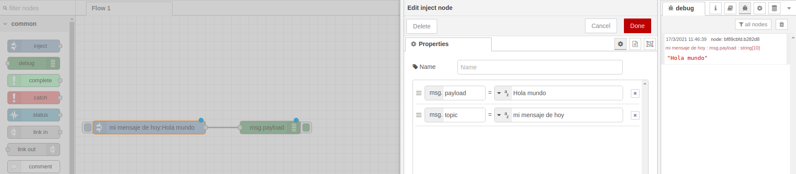

   Figure 1 Uso de nodos *Inject* y *Debug*

En Figura 2 mostramos un ejemplo en el cual usamos, aparte de los nodos *Jnject* y *Debug*, un nodo *Function* que permite aplicar al mensaje que se inyecta 
en el nodo *inject* una función. La función puede ser lo complicada que uno desee, desde simples operaciones a funciones complejas, o llamadas *ajax* 
para transmitir datos entre cliente y servidor web.

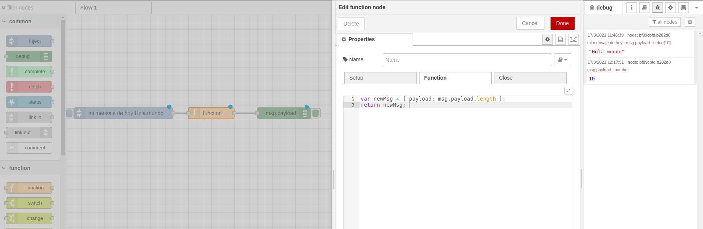

   Figure 2 Uso de nodo *Function* 

Una vez que se han arrastrado los nodos y se han configurado adecuadamente para que realicen la tarea deseada, tal como se muestra en la Figura 3 se debe 
activar el botón *Deploy* en la parte superior derecha del lienzo para desplegarlo al servidor y obtener el resultado de la tarea deseada, en el panel de información.

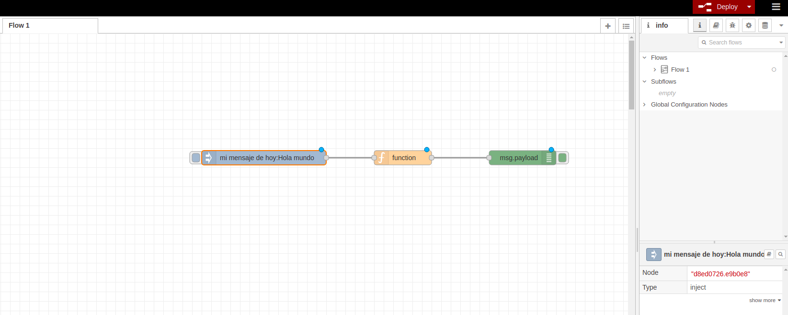

   Figure 3 Desplegar el nodo al servidor

Tal como se ha mencionado anteriormente AItenea tiene la capacidad de crear diversos modelos complejos, entrenarlos y hacer predicciones, y para 
tal fin, resultan de especial interés algunos de los nodos de funcionalidad *network*, que pueden ser muy útiles para nuestro desarrollo, y ejemplificamos 
a continuación algunos de ellos:

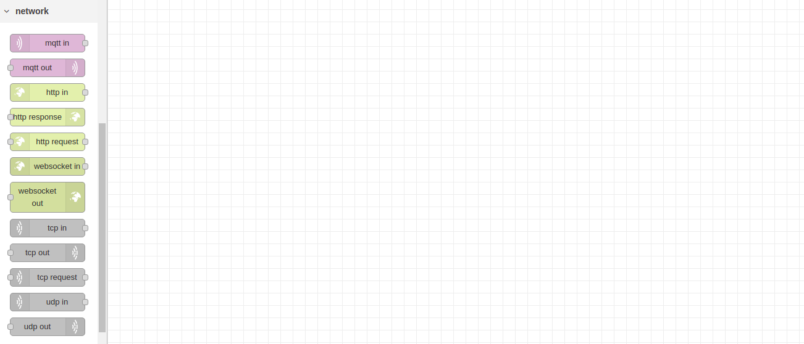

   Figure 4 Nodo *network* de *Node-Red*

* *mqtt* que es un protocolo de comunicación M2M (*machine-to-machine*) de tipo message queue, industrial. 
  Un modelo de AItenea realiza predicciones sobre una variable que caracteriza un sistema dado, y a través de este protocolo 
  se pueden mandar mensajes de alerta o activación de algún sistema en función de dicha predicción. 

* *http* que es el protocolo de comunicación cliente servidor, a través del cual por ejemplo se puede enviar la predicción realizada por un modelo de AItenea.
  
* TCP y *websocket* que permiten una comunicación directa entre una aplicación web y un servidor *WebSocket*
  
Esta característica ofrece a AItenea una funcionalidad muy importante; la de comunicarse y realizar todo tipo de acciones sobre sistemas que soporten 
estos protocolos, activar por ejemplo un mecanismo de refrigeración si el modelo predice un aumento de la temperatura, o un aviso a una flota de vehículos 
si el modelo predice un aumento de emisiones de gases contaminantes.    

**Nodos específicos de AItenea**:

Los nodos implementados en AItenea se han agrupado en categorías (*AItenea Data Cleaning*, *AItenea Connector*, *AItenea Smart Pipe*), según la funcionalidad 
que desempeñan, tal como se muestra en Figura 5. 

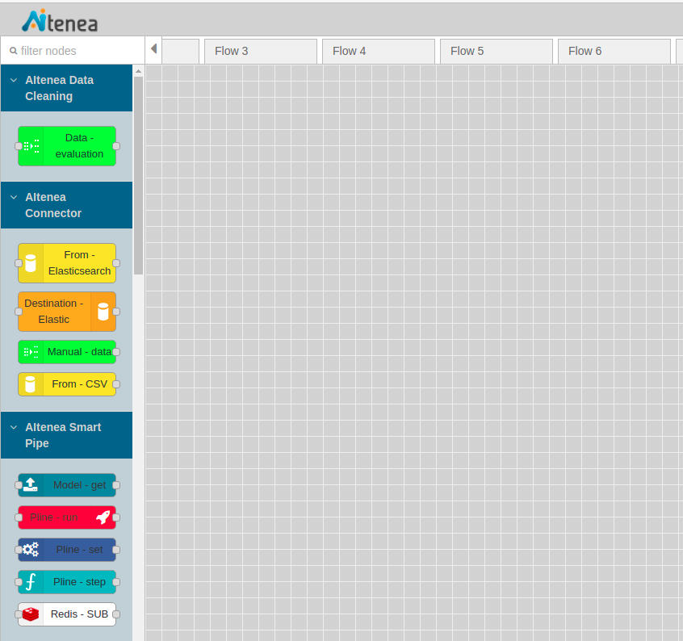

   Figure 5 Los nodos específicos implementados en AItenea

*  *Data-evaluation* ha sido implementado para realizar una estadística previa básica de los datos obteniendo el valor mínimo, 
   máximo, los percentiles, la media o la varianza, tal como se muestra en la Figura 6:

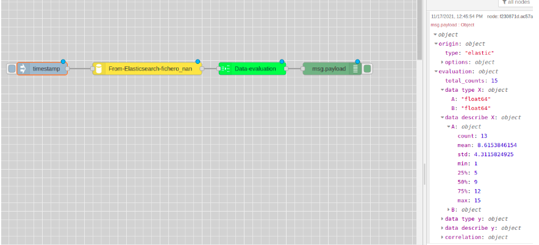

   Figure 6 Nodo *Data-evaluation*    

*  *From Elasticsearch* es un nodo implementado para la herramienta AItenea para gestionar datos desde un índice de *Elasticsearch*, y posteriormente 
   usarlos en los algoritmos implementados en AItenea. En la ventana de despliegue del nodo Figura 7. el usuario tiene la opción de elegir un índice 
   de su base de datos, y se le muestra un desplegable con las variables de ese índice, que el usuario pódra gestionar. 

   En su despliegue se abre una ventana en la que se muestra la siguiente información:

   * Lista de los índices existentes en *Elasticsearch*.
   * Un desplegable con todas las variables del índice escogido, de entre las cuales se escogen las variables *X* (features).
   * Un desplegable con todas las variables del índice escogido, de entre las cuales se escogen el/los valor/es objetivo *Y*, si el modelo lo requiere.
   * Se ofrece la posibilidad de seleccionar los datos a través de una query tal como se muestra en el siguiente código como ejemplo.

.. code-block:: JSON
    :linenos:

      {
       "bool": {
          "must": [],
          "filter": [
             {
               "match_all": {}
             }
          ],
          "should": [],
          "must_not": [
            {
              "match_phrase": {
                  "C": "5"
               }
            } 
          ]  
      }

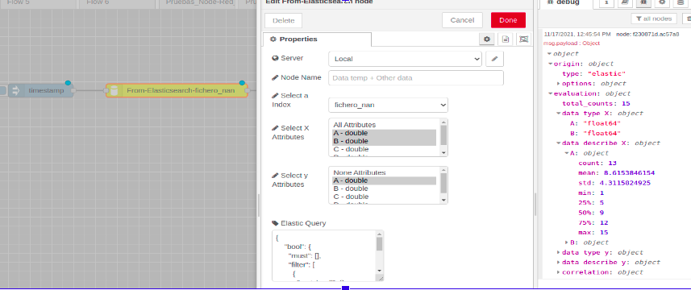

   Figure 7  Nodo *From Elasticsearch*

*  *Destination Elastic* tiene la funcionalidad de modificar índices existentes o crear nuevos índices. En su ventana de despliegue se requiere introducir la siguiente información:
   * Nombrar el índice.
   * Existe la posibilidad de seleccionar que se sobreescriba el índice en caso de que ya existía.

   
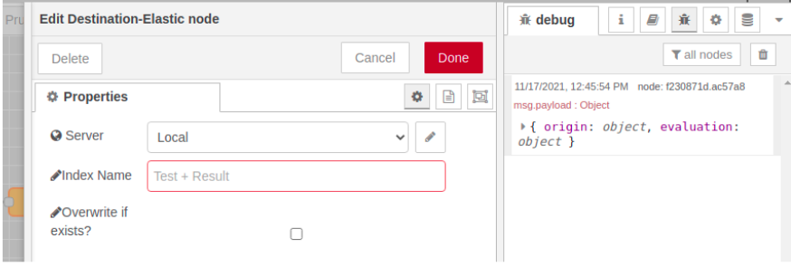

   Figure 8 Nodo *Destination Elastic*

*  *Manual-data* El despliegue del nodo *Manual-data* abre una ventana, como la que se muestra en la 
   Figura 9, que permite introducir un set de datos artificial en formato JSON, que pueda servir para realizar pruebas rápidas de los modelos.

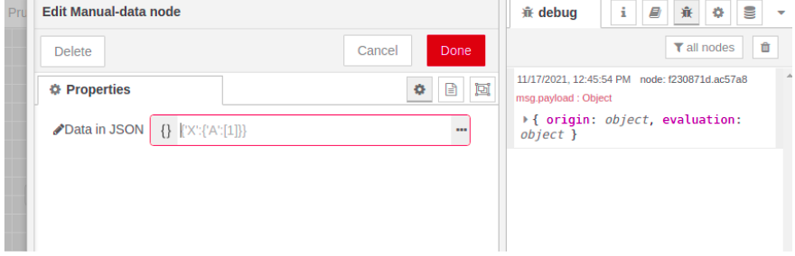

   Figure 9 Nodo *Manual-data*

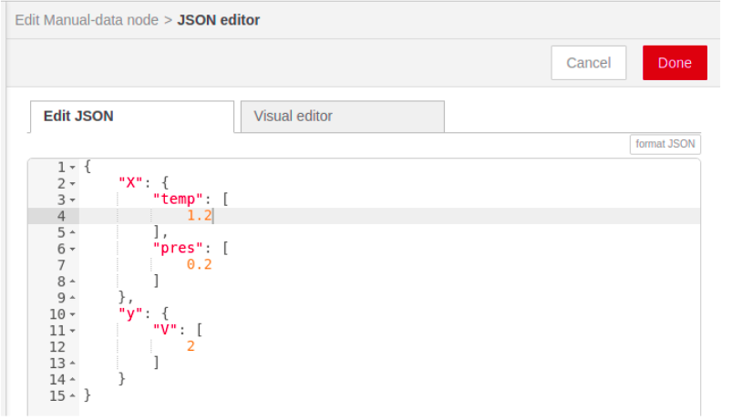

   Figure 10 Nodo *Manual-data*

*  *From CSV* es un nodo implementado para la herramienta AItenea para gestionar datos desde un CSV, y posteriormente 
   usarlos en los algoritmos implementados en AItenea. Para hacer el nodo funcional, se requiere de los siguientes datos por parte del usuario:
     
   *  El nombre del usuario de AITenea.
   *  La clave del usuario de AITenea.

   Una vez introducidos los datos se guarda la configuración haciendo click en *Add*, y se abre una nueva ventana en donde el usuario 
   tiene la opción de elegir un índice de su base de datos de *Elasticsearch*, y se le muestra un desplegable con las variables de ese índice, que el 
   usuario podrá gestionar.

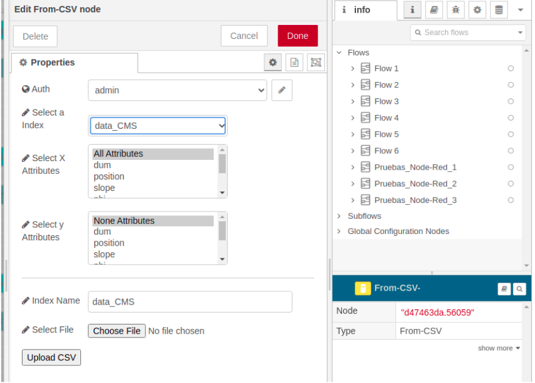

   Figure 11  Nodo *From CSV*

Además el usuario cuenta con la opción de subir un archivo CSV como un nuevo índice siguiendo los siguientes requisitos:
   *  Se debe dar un nombre al nuevo index, los caracteres permitidos son letras, número, guiones y barras bajas.
   *  El usuario debe pulsar en "Examinar..." y elegir archivo de su equipo, este debe contar con una cabecera y tener un delimitador estándar, por ejemplo, comas o espacios.
   *  Una vez se pulsa en "Upload CSV" se mostará un texto de estado que indicará si la subida sigue en curso o ha finalizado, si ocurre un error, se informará con una alerta.

   
*  *Model get* al seleccionar un modelo del desplegable con los modelos guardados en AItenea, se carga automáticamente la siguiente información: 
    * Autentificación de usuario: cada usuario tendrá su *frontend* al que accede con su nombre de usuario y clave.
    * El fichero de datos que se ha usado al crear el modelo: *pLine Table*.
    * La lista de características que se han usado al crear el modelo: *pLine X*.
    * La(s) variable(s) objetivo: *pLine Y*.

   
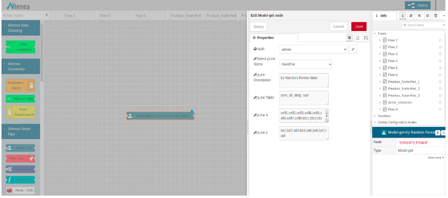

   Figure 12 Nodo *Model-get*, seleccionar modelo entrenado de AItenea 

*  *Pline-run* Este nodo se ha implementado con la funcionalidad de *ejecutar* la tubería una vez que esté creada y 
   que se hayan introducido los pasos que la componen. En su ventana de despliegue se requerirá:

   *  Autentificación de usuario: cada usuario tendrá su *frontend* al que accederá con su nombre de usuario y clave. Cada usuario tendrá acceso a las *Plines* que ha creado y podrá ejecutar sobre las mismas alguna de las acciones disponibles. 
   *  Seleccionar una acción de la lista de acciones disponibles: *fit*, *fit_transform*, *fit_predict*, *predict*.
   *  Seleccionar el porcentaje del set de datos que se usará para el entrenamiento.
   *  Ofrece la opción de utilizar el algoritmo seleccionado en un algoritmo genético, con los parámetros escogidos como parámetros genéticos. 

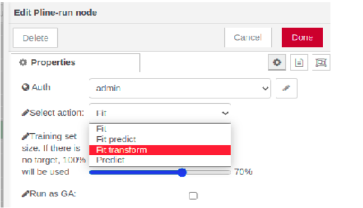

   Figure 13 Nodo *Pline-run*

*  *Pline set* es el nodo que crea la tubería, establece los atributos principales de la misma. Debe crearse antes de empezar a crear las
   sucesivas tareas que compondrán la tubería.
   Se requiere:

   * Autentificación de usuario: cada usuario tendrá su *frontend* al que accederá con su nombre de usuario y clave.
   * Overwrite if exists, lo que elimina posible error al existir una tubería con el mismo nombre. El usuario puede reescribir la tubería si así lo desea.

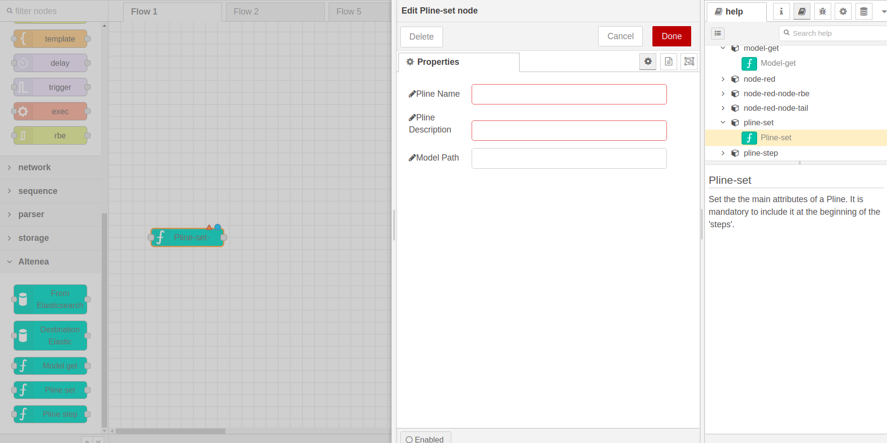

   Figure 14 Crear una tubería
 

*  *Pline step*  El despliegue del nodo *Pline-step*, cuya funcionalidad es de introducir sucesivamente tareas a la tubería previamente creada 
   se nos abre la siguiente ventana en la cual se nos requiere:

   *  Seleccionar el tipo de clase, *aitenea_transform* o *aitenea_ai*.
   *  Escoger la clase deseada,  del desplegable con las clases implementadas en AItenea.

  
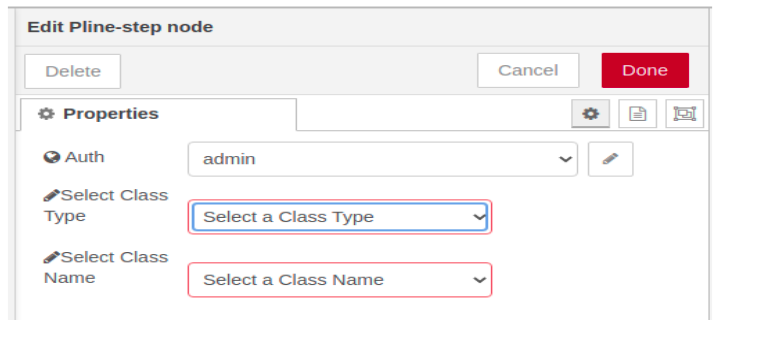

   Figure 15 Nodo *Pline-step*

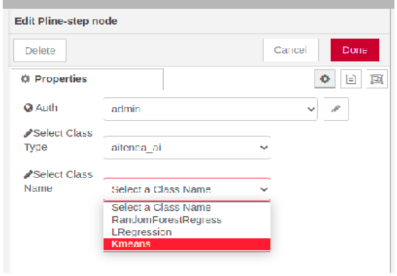

   Figure 16 Nodo *Pline-step*

En Figura 17 se muestra un flujo simulación a modo de ejemplo de uso de los nodos de AItenea; se lee el fichero de datos con características de 
vinos, se aplica como primer paso una transformación *StdScaler* y como segundo paso un modelo *machine learning* (*KMeans*), y se aplica un *fit_predict*.   

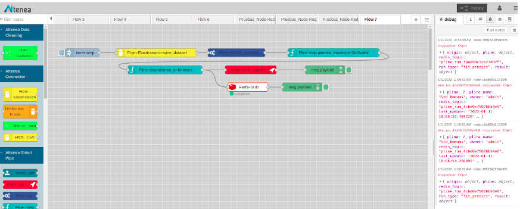