Manual de usuario
==========================

Introducción
--------------
El presente documento ha sido estructurado en dos capítulos.
En el primer capitulo se describe el procedimiento a seguir por 
el usuario a la hora de implementar algoritmos a través de nuevas
clases, sean de transformación o de *machine learning*.

A la hora de implementar una nueva funcionalidad en AItenea se debe seguir 
el siguiente esquema de directorios:

nueva_funcionalidad/
  __init__.py

  class_name.py

  _auxiliar_files.py

  test/

Si ya existe un directorio con algoritmos cuya tipología fuese similar al 
que se desea implementar, se puede añadir en el mismo directorio el fichero `class_name.py`.

En el segundo capitulo se describe el funcionamiento de 
la interfaz gráfica de AItenea, descripción de los nodos y 
los pasos necesarios en la creación de un flujo de simulación.

Manual de programación de algoritmos
-------------------------------------
El desarrollo de las clases presentes en AItenea se fundamenta básicamente
sobre dos clases base, *base_class_preprocessing*, de la que heredan
las clases de transformación, y *base_class_ai*, de la que heredan clases 
cuya funcion es de desarrollar algoritmos de *machine learning*.

**Clases de transformación**

Según requerido por la clase base, los parámetros de la 
clase de *transformación* implementada se deben introducir en 
forma de diccionario. Para cada parámetro se debe proporcionar:

*  *type*: el tipo del mismo (*int*, *str*,..etc).
*  *default*: el valor por defecto.
*  *gen*: variable que, si toma valor *True*, se usa como gen en un algoritmo evolutivo.    

.. code-block::
   
   class_options={"parameter1":{"type":" ","default":" ","gen":" "},
                  "parameter2":{"type":" ","default":" ","gen":" "},};
   
   self.class_parameters ={"options":class_options};

Los parámetros son los elegidos por el programador y deben ser 
representativos del algoritmo implementado.

Cualquier clase de transformación que se desee implementar debe 
contener, según lo requerido por la clase base, los siguientes métodos:
*get_info*, *init_selector*, *fit*, *transform*, *fit_transform*.

El métddo *get_info* debe ofrecer información general sobre el algoritmo 
implementado: atributos, objetivo, funcionalidad.

El método *init_selector* es el método en el cual se realiza la inicialización
del algoritmo, en caso de que sea necesario.

El método *fit* es implementado por cada estimador, acepta como entrada de 
datos los atributos *X* del modelo y la variable objetivo *Y* ,para los 
modelos supervisados. Normalmente, el estimador realiza la validación de 
parámetros y los datos. También es responsable de estimar los atributos de 
los datos de entrada y almacenar los atributos del modelo y, finalmente, 
devolver el resultado a través del parámetro *self*.

El método *transform* acepta como datos de entrada los atributos *X*. 
Los parámetros generados a partir del método *fit*, aplicados sobre el 
modelo devuelven un conjunto de datos transformados.

El método *fit_transform* aplica en un mismo paso el *fit* y posteriormente
*transform*. Recibe como datos de entrada los atributos *X* y la variable 
objetivo *Y*, y devuelve como salida el set de datos transformado.

**Clases de machine learning**

Según lo requerido por la clase base, los parámetros de la clase de 
*machine learning* implementada se deben introducir en 
forma de diccionario.

.. code-block::
   
   class_options={"parameter1":{"type":" ","default":" ","gen":" "},
                  "parameter2":{"type":" ","default":" ","gen":" "},};
   
   self.class_parameters ={"options":class_options};

   class_genetic_parameters = {"fitness_functions": {"type": " ", 
                               "range": [" "], "default": [" "]}};

   self.class_genetic_parameters = {"options": class_genetic_parameters};

Los parámetros son los elegidos por el programador como representativos del 
algoritmo implementado. Si el modelo implementado se usa dentro de un algoritmo
genético se debe proporcionar la función *fitness* que determinara la selección 
de los mejores individuos, que seguirán evolucionando.   

Cualquier clase de *machine learning* que se desee implementar debe contener, 
según lo requerido por la clase base, los siguientes métodos: *get_info*, 
*init_selector*, *fit*, *predict*, *fit_predict*, *score*.

El método *get_info* debe ofrecer información general sobre el algoritmo 
implementado: atributos, funcionalidad, objetivo.

El método *init_selector* es el método en el cual se realiza la inicialización
del algoritmo, en caso de que sea necesario.

El método *fit* toma los datos de entrenamiento como argumentos, que pueden 
ser una matriz *X* en el caso del aprendizaje no supervisado, o dos matrices
*X* e *Y* en el caso del aprendizaje supervisado, y se ajusta el modelo. El 
modelo en el método de ajuste puede ser tan simple como resolver una ecuación
dada o tan complicado como un modelo de aprendizaje automático. El método 
devuelve el resultado a través del parámetro *self*.

El método *predict* acepta como datos de entrada los atributos *X*. A partir
de los parámetros generados en el método *fit*, se realiza una predicción 
sobre nuevos datos presentados al algoritmo y se devuelve el resultado de la
predicción.

El método *fit_predict* realiza el *fit* y *predict* en un mismo paso. Los 
datos de entrada son los atributos *X* y el objetivo *Y*, y devuelve el 
resultado de la predicción. 

El método *score* introduce la función de evaluación, a través de 
*class_genetic_parameters*, que se usará como métrica 
cuando el algoritmo implementado se use en un algoritmo genético. 

**Consejos de buenas practicas**

*Uso de decoradores* 

Los decoradores son muy útiles para reutilizar código que desempeña tareas
comunes, y ayuda a que nuestro código sea más corto y limpio. En AItenea 
seguimos en esta línea y hemos implementado decoradores.
Tanto en las clases de *trasformación* como en las clases de *machine learning* 
los módulos: *fit*, *fit_transform* y *fit_predict* deben incluir *@fit_decorator*. 
Es una función que asegura la coherencia, entre la entrada y la salida de los 
datos en cada tarea del flujo de simulación.

*Clases auxiliares*

Es aconsejable que los métodos de las clases implementadas en AItenea sean 
concisos, sencillos, con pocas lineas de código. Si el algoritmo que se desea 
implementar comprende cálculos laboriosos se recomienda construir una 
clase auxiliar en la que se desarrolle parte de la algoritmia necesaria. 
Se expone un breve ejemplo ilustrativo.

.. code-block:: python
  
   from aitenea.aitenea_core.base_class_preprocessing import BaseClassPreprocessing
   from aitenea.logsconf.log_conf import logging_config
   from aitenea.aitenea import _MiClaseAux

   class MiClase(BaseClassPreprocessing):
      options = {
          "parameter1": {"type": " ","default": " ", "gen": " "},
          "parameter2":{"type": " ","default":" ", "gen":" "},
      }
      def __init__(self, user_parameters, user_genetic_parameters=None):
          class_options = {
            "parameter1": {"type": " ","default": " ", "gen": " "},
            "parameter2":{"type": " ","default":" ", "gen":" "}, 
          }
          self.class_parameters = {'options': class_options}
          super(MiClase, self).__init__(
                self.__class__.__name__, self.class_parameters, user_parameters)
          self.mind = _MiClaseAux()
    
      def get_info(self):
          descripcion= "Información sobre la clase: parámetros, funcionalidad"
          return descripcion

      def init_selector(self):
          "Inicializar el algoritmo"
          pass

      @fit_decorator
      def fit(self, X, y=None):
          options = self.parameters_values['options']
          param1 = options["parameter1"]
          param2 = options["parameter2"]
          self.mind.set_parameter(param1,param2)
          return self
        
      @fit_decorator
      def fit_transform(self, X, y=None):
          self.fit(X)
          return self.transform(X)
            
      def transform(self, X):
          return self.mind.calculate(X)

.. code-block:: python
  
    class _MiClaseAux(object):
      def __init__(self):     
        
      def set_parameter(self,param1,param2):
         "Establecer valor de los parámetros del modelo"

      def calculate(self,X):
         "Implementacion de la algoritmia y devolver resultado del modelo"
         return 

Los métodos *set_parameter* y *calculate*, de la clase auxiliar *_MiClaseAux*
tienen la funcionalidad, el primero de establecer los valores por defecto 
de los parámetros del modelo, y el segundo, de implementar la algoritmia del modelo.

Manual de uso de la interfaz gráfica de AItenea
------------------------------------------------

Como parte del desarrollo de la interfaz grafica de AItenea se han implementado
una serie de nodos agrupados en: *Data Cleaning*, *Connector* y *Smart Pipe*. 
Esto permite la programación en flujos para realizar distintas tareas de 
transformación de datos o crear modelos más complejos de *machine learning*. 
El flujo de simulación puede contener varias tareas de transformación pero 
solamente una tarea de *machine learning* que debe ser la última del mismo.

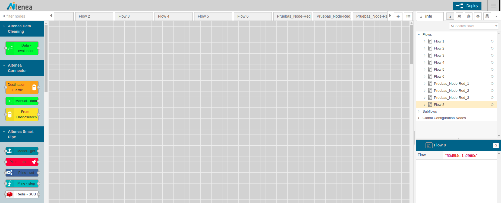

  Figura 1. *Frontend* AItenea                     

**Data Cleaning**

El nodo *Data Evaluation* tiene la funcionalidad de ofrecer un conocimiento 
previo de los datos. Al desplegarlo, el usuario puede cargar un fichero 
y realizar una estadística básica de los datos, obteniendo el valor mínimo,
máximo, los percentiles, la media, la varianza... tal como se muestra en 
la figura. Desde el lado izquierdo del lienzo se arrastra el nodo y en el 
lado derecho se muestra el resumen con la estadística de los datos.  

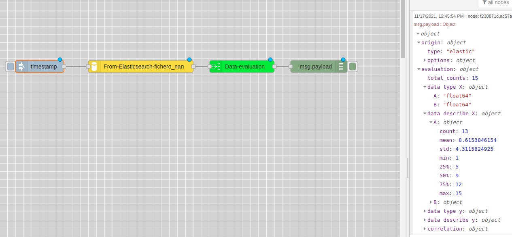

  Figura 2. Nodo *Data Evaluation*

**Connector**

El usuario dispone de una serie de nodos cuya funcionalidad es la de gestionar
índices en la base de datos, *From ElasticSearch*, *Destination Elastic*, o 
generar un set de datos artificial con *Manual-data*. 

El nodo *From Elasticsearch* tine la funcionalidad de acceder a los 
índices existentes en la base de datos. En su despliegue se abre una
ventana en la que se requiere introducir la siguiente información:

* Escoger un índice.

* Seleccionar los atributos *X*.

* Seleccionar un valor objetivo *Y*, si el modelo lo requiere.

* Se ofrece la posibilidad de seleccionar los datos a traves de una *query* 
  tal como se muestra en el siguiente código como ejemplo.

.. code-block:: JSON

    {
    "bool": {
      "must": [],
      "filter": [
        {
          "match_all": {}
        }
      ],
      "should": [],
      "must_not": [
        {
          "match_phrase": {
            "C": "5"
          }
        }
      ]
    }
                       
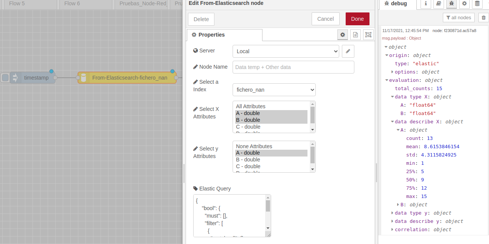

  Figura 3. Nodo *From Elasticsearch*

El nodo *Destination Elastic* tiene la funcionalidad de modificar 
índices existentes o crear nuevos índices. En su ventana de 
despliegue se requiere introducir la siguiente información:

* Nombrar el índice
  
* Existe la posibilidad de seleccionar que se sobreescriba 
  el índice en caso de que ya exista  

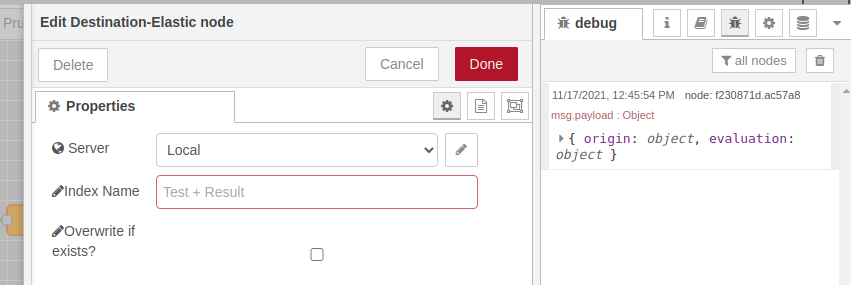

  Figura 4. Nodo *Destination Elastic*

El despliegue del nodo *Manual-data* abre una ventana, como la 
que se muestra en la figura, que permite introducir un set de 
datos artificial en formato JSON.

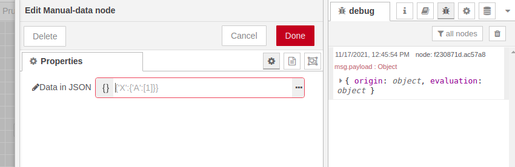

  Figura 5. Nodo *Manual-data*

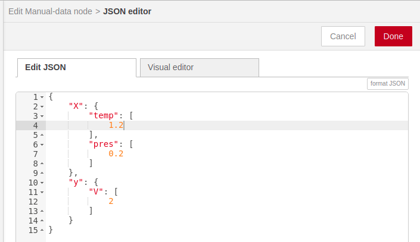

  Figura 5a. Nodo *Manual-data*        

La funcionalidad del nodo *From CSV* es de gestionar datos desde un CSV, 
y posteriormente usarlos en los algoritmos implementados en AItenea. 
En su despliegue se requiere de los siguientes datos por parte del usuario:

*  El nombre del usuario de AItenea.
*  La clave del usuario de AItenea.

Una vez introducidos los datos se guarda la configuración haciendo *click* en *Add*, 
y se abre una nueva ventana en donde el usuario tiene la opción 
de elegir un índice de su base de datos de *Elasticsearch*, y se le muestra un 
desplegable con las variables de ese índice, que el usuario podrá gestionar.
Además, el usuario cuenta con la opción de subir un archivo CSV como un nuevo índice siguiendo los siguientes requisitos:

* Autentificación de usuario: cada usuario accederá con su nombre de usuario y clave, accederá a su directorio de ficheros y elegirá el fichero que desea leer. 
* Se debe dar un nombre al nuevo index, los caracteres permitidos son letras, números, guiones y guiones bajos.
* El usuario debe pulsar en "Examinar..." y elegir archivo de su equipo, este debe contar con una cabecera y tener un delimitador estándar, por ejemplo, comas o espacios.
* Una vez se pulsa en "Upload CSV" se mostrará un texto de estado que indicará si la subida sigue en curso o ha finalizado. Si ocurre un error, se informará con un mensaje de alerta.

  Figura 6. Nodo *From CSV*   
        

**Smart Pipe**

Al desplegar el nodo *Pline set*, cuya función es la de crear una tubería,
se requiere introducir los siguientes campos:

* Nombrar la tubería.
  
* Introducir una breve descripción de la misma.

* Ofrece la posibilidad de reescribir la tubería si ya existe.

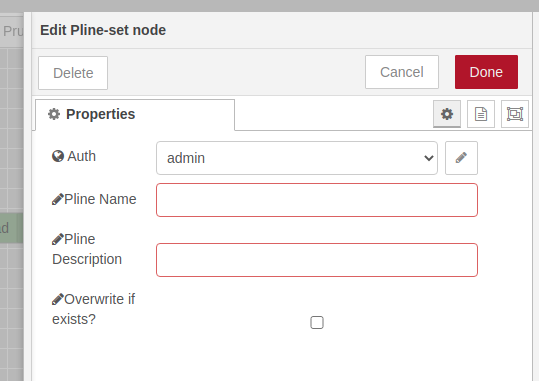

  Figura 7. Nodo *Pline-set*

El propósito de la tubería es agrupar varios pasos (tareas) que 
se pueden validar de forma cruzada juntos mientras se establecen
diferentes parámetros para cada uno de ellos.

El despliegue del nodo *Pline-step*, cuya funcionalidad es la de 
introducir sucesivamente tareas a la tubería previamente creada, 
se nos abre la siguiente ventana:

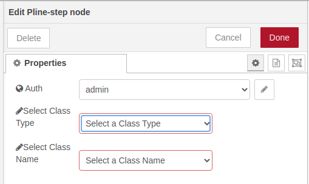

  Figura 8. Nodo *Pline-step*

en la cual se nos requiere: 

* Seleccionar el tipo de clase, *aitenea_transform* o *aitenea_ai*.

* Escoger la clase del desplegable con las clases 
  implementadas en AItenea.

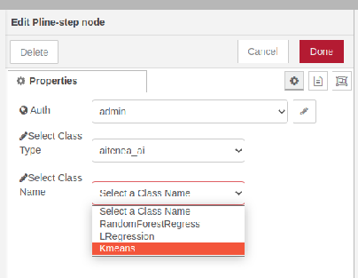

  Figura 9. Nodo *Pline-step*     

En el despliegue del nodo *Pline-run*, cuya funcionalidad es de 'ejecutar' 
la tubería, se nos requerirá:

* Seleccionar una acción de la lista de acciones disponibles: *fit*,
  *fit_transform*, *fit_predict*, *predict*.
  
* Seleccionar el porcentaje del set de datos que se usara para
  el entrenamiento.

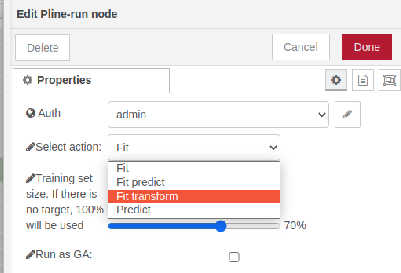

  Figura 10. Nodo *Pline-run*    

Una vez que se ha creado un modelo en AItenea, posteriormente se puede cargar 
el modelo y usar con nuevos datos para su transformación, o para hacer predicciones. 
Todo esto a través del nodo *Model-get*, en cuyo despliegue se nos requiere escoger 
el modelo, de una lista de modelos desarrollados en AItenea, y se carga automáticamente 
información necesaria sobre el mismo. 

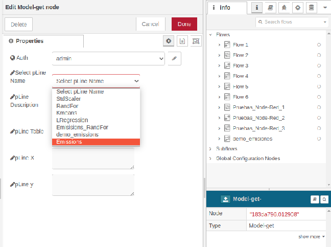

  Figura 10. Nodo *Model-get* 

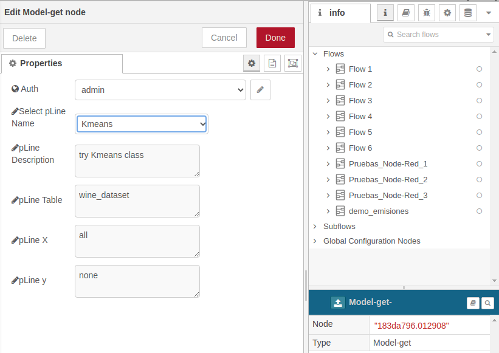

  Figura 11. Nodo *Model-get* 

En el despliegue del nodo *Redis-SUB*, cuya funcionalidad es de actualizar 
el estado de ejecución de la *Pline* mediante un indicador visual y logs
en la consola de *Node-RED*.

* Deberemos introducir una cadena de conexión en el nodo, debe de ser la misma
  que use AITenea si queremos mantener la funcionalidad en el backend.

Ejemplo de cadena de conexión.

.. code-block:: JSON

    {
        "host":"0.0.0.0", 
        "port":6379, 
        "password":"password", 
        "db":0 
    }

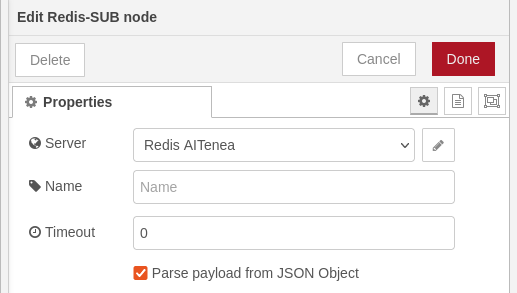

  Figura 11. Nodo *Redis-SUB*   

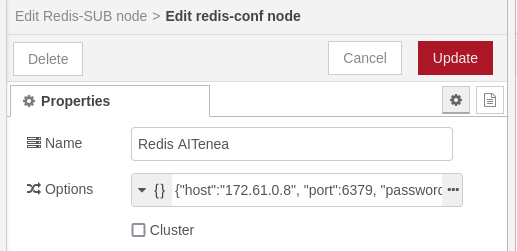

  Figura 11. Conexión Nodo *Redis-SUB*  

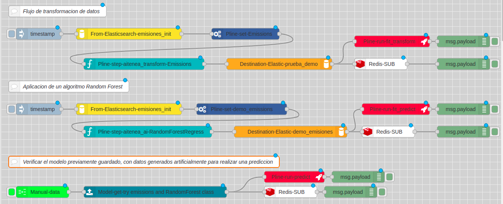

  Figura 11. Ejemplo de flujo de simulación 